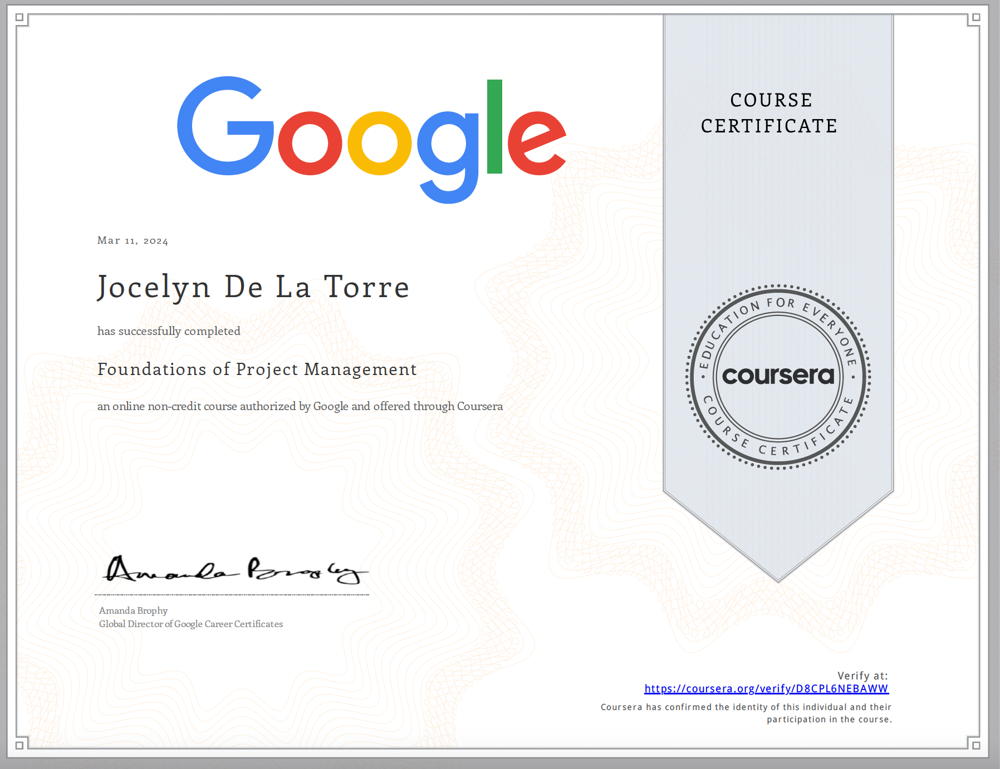

Jocelyn De La Torre
============

Education
---------

   **BA, Communication Studies**; Califonia State University (Northridge)   **2021-2023**

   **Associate in Arts Transfer Degree, Communication Studies**; Pasadena City College   **2016-2020**

Certificates
---------

Experience
----------

**Tech Support:** Tseng College Distance Learning (Northridge, CA)  **2022-2023**

* Provide tech support to faculty and students in the Master's program
* Maintian working knowledge of Zoom, Canvas, Panopto, and Microsoft
* Provide training to faculty regarding Zoom, Canvas, and Panopto softwares
* Update and create manuals

**Social Media Manager/Retail Associate:** PopCave (Santa Clarita, CA)  **2022-2022**

* Created and managed social media and website content
* Utilized Instagram and Shopify to review online analytics
* Managed store inventory and daily sales
* Executed opening and closing procedures

**Legal Assistant:** The Ticket Clinic (Studio City, CA)  **2020-2022**

* Assistant to firm's supervising attorney
* Managed court schedules for eight attorneys in 15 counties across California
* Communicated and coordinated between clients, court clerks, attorneys, and DA offices
* Approved incoming cases taken in by other legal assistants
* Provided daily and weekly reports to attorneys and firm's CEO

**Retail Associate:** Mickey's of Glendale (Glendale, CA)  **2016-2020**

* Cash handling, register and customer service experience
* Assisted in visual merchandising and product development
* New employer trainer
* Processed and shipped onine orders domestic and international

Projects
--------------------

**D23 Expo: The Ultimate Fan Event** Shift Lead    **2017 & 2019**

* Communicated and coordinated with event staff, volunteers, and Disney Parks employees
* Assisted in the operations of Mickey's of Glendale pin store at the Parks & Resorts Pavilion

**Walt Disney Imagineering - Craft Fair** Coordinator

* Provided support to event producer and vendors for event
* Coordinated the set-up of 20+ vendor booths 

Programming Languages
:   **first-lang:** Here, we have an itemization, where we only want
    to add descriptions to the first few items, but still want to
    mention some others together at the end. A format that works well
    here is a description list where the first few items have their
    first word emphasized, and the last item contains the final few
    emphasized terms. Notice the reasonably nice page break in the pdf
    version, which wouldn't happen if we generated the pdf via html.

:   **second-lang:** Description of your experience with second-lang,
    perhaps again including a [link] [ref], this time placing the url
    reference elsewhere in the document to reduce clutter (see source
    file). 

:   **obscure-but-impressive-lang:** We both know this one's pushing
    it.

:   Basic knowledge of **C**, **x86 assembly**, **forth**, **Common Lisp**

[ref]: https://github.com/githubuser/superlongprojectname

Skills:
----------------------------------------
     * English (native speaker)   * Spanish (proficient)   * Cross functional communicator   
     * Interpersonal    * Administrative   * Computer technology   * Micrsoft Office   
     * Organizational   * Client management    * Skilled collaborator   * Time management
     * Solutions oriented   *Video editing   * Prompt engineering    * Project planning

Computer Languages:
--------------------
  * Markdown (beginner)
